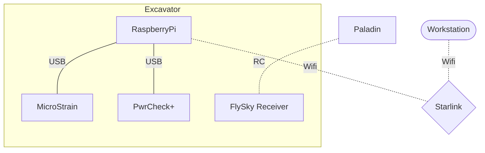

# 

# Lunar Wombats Demonstration

## Introduction

The Lunar Wombat project is particiating in a [NASA Challenge](https://breaktheicechallenge.com/) to demonstrate
the collection and transportation of icy lunar regolith. The rover needs to be able to excavate icy rock from the 
surface and transport it to a loading location.


## System Overview

The diagram below shows the basic communication architecture for the system.

- Internet and a local Wifi network are provided by Starlink
- An RC controller is used to operate the system
- Onboard data collection is run from a Raspberry Pi (RPi) with Wifi and RJ45 network capability



> **Note**
> The RPi needs access to the internet for time synchronization via NTP.

## Data Collection

The Raspberry Pi is the main computer, which runs the Python executable [lunar_wombat](lunar_wombat.py) via a shell [script](wombat_data.sh).
The script is managed by systemd and is triggered via the General Purpose Input and Output (GPIO) of the RPi.

To stay flexible with onsite operations, the code requires a manual trigger to initiate the sequence of data collection A series of commands is run to collect
data during the different modes of operation - system characterization or general telemetry collection. Logs are collected via systemd to allow for analysis of
errors during operations.

Power telemetry is collected from at 1 Hz from a PwrCheck+ device in this [repository](../PowerCheck). The Microstrain device collects inertial and environmental
data at rates of up to 500 Hz for certain measurands: accelerometer, gyro, magnetometer, GPS, pressure, etc. That code is also available in the [repository](../Microstrain).

### Code Background

The drivers were developed and tested independently, and structured in a way to allow them to be managed via the asyncio module. The code collects all the
data as raw streams and processes to csv form at the end of a run. It also supports a reprocessing workflow in case the data collection is interrupted due
to an unexpected loss of power or other issue with the RPi.

## Software Updates

When internet is available on the RPi the files from the main branch can be pulled directly onto it using wget, for example:

```
GIT_URL=https://raw.githubusercontent.com/Utilis-Machina/software/main
FILE=Demos/lunar_wombat.py
wget ${GIT_URL}/${FILE}
```
